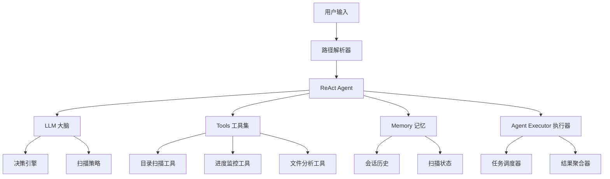

# ClearAI React 集成计划

## 项目概述

将 ReAct（Reasoning and Acting）模式集成到 ClearAI 项目中，实现智能多目录扫描功能，让用户能够通过简单的路径指定语法（如"帮我清理一下这个路径：@具体路径"）快速指定需要清理的目录，无需复杂的路径推理。

## 核心目标

1. **简化路径输入**：通过@语法让用户直接指定路径，避免复杂的路径推理
2. **多目录扫描**：支持同时扫描多个目录，实时显示进度
3. **渐进式优化**：从当前TUI平滑过渡到React增强界面
4. **交互优化**：提供便捷的路径输入体验和智能提示

## ReAct 架构设计

### 1. 核心组件



### 2. 项目结构

```
src/main/java/com/hanpf/clearai/
├── cli/
│   ├── cleaning/
│   │   ├── react/              # ReAct 相关类
│   │   │   ├── ReActAgent.java
│   │   │   ├── PathInputParser.java
│   │   │   ├── MultiDirectoryScanner.java
│   │   │   └── ProgressTracker.java
│   │   └── AIAnalysisService.java (现有)
│   └── ClaudeTUI.java (修改)
├── react/                      # 新增 React 包
│   ├── agent/
│   │   ├── ReactAgent.java
│   │   ├── ReactMemory.java
│   │   └── ReactExecutor.java
│   ├── tools/
│   │   ├── PathInputTools.java
│   │   ├── MultiScanTools.java
│   │   └── ProgressTools.java
│   ├── ui/
│   │   ├── ReactTUI.java
│   │   └── ProgressDisplay.java
│   └── input/
│       ├── PathInputHandler.java
│       └── InputSuggestion.java
└── config/
    └── ReactConfig.java
```

## 实施阶段

### 阶段1：基础 ReAct 框架搭建（2-3天）

#### 1.1 核心接口定义

```java
// ReactAgent.java - 核心ReAct代理
@AiService
public interface ReactAgent {

    @SystemMessage("""
        你是一个智能文件清理助手，专门处理用户明确指定的路径扫描请求。

        工作流程：
        1. 理解用户输入的真实意图
        2. 从用户输入中提取@指定的路径
        3. 验证路径的有效性
        4. 规划扫描策略和优先级
        5. 调度多目录扫描任务
        6. 聚合分析结果

        响应格式必须是有效的JSON，包含以下结构：
        {
          "reasoning": "分析过程说明",
          "actions": ["具体操作列表"],
          "paths": ["用户指定的路径列表"],
          "strategy": "扫描策略"
        }
        """)

    @UserMessage("用户请求: {{userInput}}")
    String processUserRequest(@V("userInput") String userInput);
}
```

#### 1.2 路径输入解析器

```java
// PathInputParser.java
public class PathInputParser {

    private static final Pattern PATH_PATTERN = Pattern.compile("@([^\\s]+)");

    public List<String> extractPaths(String userInput) {
        // 从用户输入中提取@指定的路径
        Matcher matcher = PATH_PATTERN.matcher(userInput);
        List<String> paths = new ArrayList<>();

        while (matcher.find()) {
            String path = matcher.group(1);
            // 路径标准化处理
            path = normalizePath(path);
            if (isValidPath(path)) {
                paths.add(path);
            }
        }
        return paths;
    }

    private String normalizePath(String path) {
        // 路径标准化：替换环境变量，处理相对路径等
        return path.replace("~", System.getProperty("user.home"))
                 .replace("/", File.separator)
                 .replace("\\", File.separator);
    }

    private boolean isValidPath(String path) {
        File file = new File(path);
        return file.exists() && file.isDirectory();
    }
}
```

#### 1.3 路径输入工具集

```java
// PathInputTools.java
public class PathInputTools {

    @Tool("从用户输入中提取@指定的路径")
    List<String> extractPathsFromInput(@P("用户输入") String userInput) {
        return pathInputParser.extractPaths(userInput);
    }

    @Tool("验证路径是否存在且可访问")
    boolean validatePath(@P("路径") String path) {
        File file = new File(path);
        return file.exists() && file.isDirectory() && file.canRead();
    }

    @Tool("提供路径输入建议")
    List<String> suggestRecentPaths() {
        // 返回最近使用过的路径，提升用户体验
        return pathHistory.getRecentPaths();
    }

    @Tool("显示路径输入帮助")
    String showInputHelp() {
        return """
            路径输入格式：
            • 帮我清理这个路径：@C:\\Users\\username\\Downloads
            • 扫描这些目录：@D:\\Projects @E:\\Temp
            • 清理下载文件夹：@%USERPROFILE%\\Downloads

            支持环境变量：
            • %USERPROFILE% - 用户主目录
            • ~ - 用户主目录缩写
            • %TEMP% - 系统临时目录
            """;
    }
}
```

### 阶段2：多目录扫描实现（3-4天）

#### 2.1 多目录扫描器

```java
// MultiDirectoryScanner.java
public class MultiDirectoryScanner {

    private final ExecutorService executorService;
    private final ProgressTracker progressTracker;

    public ScanResult scanMultipleDirectories(List<String> paths, ScanOptions options) {
        List<CompletableFuture<DirectoryScanResult>> futures = new ArrayList<>();

        for (String path : paths) {
            CompletableFuture<DirectoryScanResult> future =
                CompletableFuture.supplyAsync(() -> scanDirectory(path, options),
                                            executorService);
            futures.add(future);
        }

        // 等待所有扫描完成，同时更新进度
        return aggregateResults(futures);
    }

    private DirectoryScanResult scanDirectory(String path, ScanOptions options) {
        progressTracker.updateProgress(path, "开始扫描...");

        try {
            List<FileInfo> files = scanFiles(path, options);
            progressTracker.updateProgress(path, "扫描完成，找到 " + files.size() + " 个文件");
            return new DirectoryScanResult(path, files);
        } catch (Exception e) {
            progressTracker.updateProgress(path, "扫描失败: " + e.getMessage());
            throw e;
        }
    }
}
```

#### 2.2 进度追踪系统

```java
// ProgressTracker.java
public class ProgressTracker {

    private final Map<String, ScanProgress> progressMap = new ConcurrentHashMap<>();
    private final List<ProgressListener> listeners = new ArrayList<>();

    public void updateProgress(String path, String status) {
        ScanProgress progress = progressMap.computeIfAbsent(path, k -> new ScanProgress());
        progress.update(status);

        // 通知所有监听器
        notifyListeners(path, progress);
    }

    public double getOverallProgress() {
        if (progressMap.isEmpty()) return 0.0;

        return progressMap.values().stream()
            .mapToDouble(ScanProgress::getCompletionPercentage)
            .average()
            .orElse(0.0);
    }

    public String getProgressSummary() {
        return String.format("总体进度: %.1f%% (%d/%d 目录完成)",
            getOverallProgress() * 100,
            getCompletedCount(),
            progressMap.size());
    }
}
```

#### 2.3 进度显示界面

```java
// ProgressDisplay.java
public class ProgressDisplay {

    private final Terminal terminal;

    public void showRealTimeProgress(ProgressTracker tracker) {
        new Thread(() -> {
            while (!tracker.isComplete()) {
                clearScreen();
                displayProgress(tracker);
                Thread.sleep(1000);
            }
        }).start();
    }

    private void displayProgress(ProgressTracker tracker) {
        System.out.println("📊 多目录扫描进度");
        System.out.println("=" + "=".repeat(50));
        System.out.println(tracker.getProgressSummary());
        System.out.println();

        for (Map.Entry<String, ScanProgress> entry : tracker.getAllProgress().entrySet()) {
            String path = entry.getKey();
            ScanProgress progress = entry.getValue();

            System.out.printf("📁 %s\n", shortenPath(path));
            System.out.printf("   %s %s\n", getProgressBar(progress), progress.getStatus());
            System.out.println();
        }
    }
}
```

### 阶段3：TUI界面升级（2天）

#### 3.1 修改 ClaudeTUI.java

```java
// 在 ClaudeTUI.java 中添加ReAct处理
private void handleUserInputWithReact(String userInput) {
    if (shouldUseReact(userInput)) {
        handleWithReAct(userInput);
    } else {
        handleWithTraditionalMethod(userInput);
    }
}

private boolean shouldUseReact(String input) {
    // 判断是否需要使用ReAct模式
    return input.contains("@") ||
           input.toLowerCase().contains("多个路径") ||
           input.toLowerCase().contains("扫描这些");
}

private void handleWithReAct(String userInput) {
    try {
        System.out.println("🔍 正在解析您指定的路径...");

        // 1. 解析用户指定的路径
        List<String> paths = pathInputParser.extractPaths(userInput);

        if (paths.isEmpty()) {
            System.out.println("❌ 未找到有效的路径，请使用@符号指定路径，例如：@C:\\Downloads");
            System.out.println("💡 输入'帮助'查看路径输入格式");
            return;
        }

        System.out.println("📋 将扫描以下路径:");
        paths.forEach(path -> {
            System.out.println("   📁 " + path);
            if (!new File(path).exists()) {
                System.out.println("      ⚠️ 路径不存在");
            }
        });

        // 2. 确认后开始扫描
        if (confirmExecution(paths)) {
            startMultiDirectoryScan(paths);
        }

    } catch (Exception e) {
        System.err.println("❌ 路径解析失败: " + e.getMessage());
        // 降级到传统模式
        handleWithTraditionalMethod(userInput);
    }
}

private boolean confirmExecution(List<String> paths) {
    System.out.println("\n确认扫描以上 " + paths.size() + " 个路径？(y/n)");
    Scanner scanner = new Scanner(System.in);
    String response = scanner.nextLine().trim().toLowerCase();
    return response.equals("y") || response.equals("yes");
}
```

### 阶段4：性能优化和错误处理（2天）

#### 4.1 智能缓存机制

```java
// ScanCache.java
public class ScanCache {

    private final Map<String, CachedScanResult> cache = new ConcurrentHashMap<>();

    public Optional<CachedScanResult> getCachedResult(String path, long maxAgeMs) {
        CachedScanResult cached = cache.get(path);
        if (cached != null &&
            System.currentTimeMillis() - cached.getTimestamp() < maxAgeMs) {
            return Optional.of(cached);
        }
        return Optional.empty();
    }

    public void cacheResult(String path, ScanResult result) {
        cache.put(path, new CachedScanResult(result, System.currentTimeMillis()));
    }
}
```

#### 4.2 错误恢复机制

```java
// ErrorRecovery.java
public class ErrorRecovery {

    public ScanResult handleScanFailure(List<String> failedPaths, List<String> successfulPaths) {
        System.out.println("⚠️ 部分目录扫描失败，正在恢复...");

        // 分析失败原因
        List<String> retryPaths = analyzeFailures(failedPaths);

        // 重试失败的扫描
        List<String> finalSuccessful = new ArrayList<>(successfulPaths);
        for (String path : retryPaths) {
            try {
                ScanResult result = scanWithReducedScope(path);
                finalSuccessful.add(path);
            } catch (Exception e) {
                System.err.println("❌ 最终无法扫描: " + path);
            }
        }

        return aggregatePartialResults(finalSuccessful);
    }
}
```

## 配置文件更新

### setting.json 扩展

```json
{
  "env": {
    "ANTHROPIC_AUTH_TOKEN": "43365548e8ba4e6d98bf9506dd436fdb.PJgEONyl2iT1PvY0",
    "ANTHROPIC_BASE_URL": "https://open.bigmodel.cn/api/paas/v4",
    "CLAUDE_CODE_DISABLE_NONESSENTIAL_TRAFFIC": 1,
    "API_TIMEOUT_MS": 600000,
    "MAX_TOKENS": 3000,
    "ANTHROPIC_MODEL": "glm-4.5-air",
    "ANTHROPIC_SMALL_FAST_MODEL": "glm-4.5-air"
  },
  "react": {
    "enabled": true,
    "maxConcurrentScans": 4,
    "cacheEnabled": true,
    "cacheMaxAge": 3600000,
    "fallbackToTraditional": true,
    "progressUpdateInterval": 1000,
    "pathValidation": true,
    "showPathSuggestions": true
  },
  "pathInput": {
    "maxRecentPaths": 10,
    "autoComplete": true,
    "environmentVariables": {
      "USERPROFILE": "C:\\Users\\{username}",
      "TEMP": "C:\\Users\\{username}\\AppData\\Local\\Temp",
      "HOME": "C:\\Users\\{username}"
    },
    "defaultSuggestions": [
      "C:\\Users\\{username}\\Downloads",
      "C:\\Users\\{username}\\Desktop",
      "C:\\Users\\{username}\\Documents",
      "C:\\Users\\{username}\\AppData\\Local\\Temp"
    ],
    "excludePatterns": ["*.tmp", "*.log", "$RECYCLE.BIN", "System Volume Information"]
  }
}
```

## 测试计划

### 单元测试

1. **PathInputParser 测试**
   - @语法路径提取准确性
   - 路径标准化处理
   - 环境变量替换
   - 边界情况处理

2. **MultiDirectoryScanner 测试**
   - 并发扫描正确性
   - 进度追踪准确性
   - 错误处理机制

3. **ProgressTracker 测试**
   - 进度计算正确性
   - 监听器通知机制
   - 多线程安全性

4. **PathInputTools 测试**
   - 路径验证功能
   - 路径建议功能
   - 历史路径管理

### 集成测试

1. **ReAct 流程测试**
   - 端到端路径输入解析
   - 多目录扫描完整性
   - 结果聚合正确性

2. **用户体验测试**
   - 路径输入格式友好性
   - 错误提示清晰度
   - 交互流畅性

3. **性能测试**
   - 大目录扫描性能
   - 内存使用优化
   - 响应时间测试

## 部署策略

### 渐进式部署

1. **Phase 1**: 保持现有功能，添加ReAct作为可选功能
2. **Phase 2**: 优化ReAct性能和准确性
3. **Phase 3**: 完全迁移到ReAct模式，移除传统扫描逻辑

### 向后兼容

- 保持现有API接口不变
- 提供配置开关控制ReAct功能
- 传统扫描模式作为降级方案

## 风险评估

### 技术风险

1. **LangChain4j ReAct 集成复杂性**
   - 风险：ReAct模式实现可能比预期复杂
   - 缓解：分阶段实施，保持降级方案

2. **多线程扫描稳定性**
   - 风险：并发扫描可能导致资源竞争
   - 缓解：充分测试，实现线程安全机制

3. **路径输入解析准确性**
   - 风险：路径解析可能出现错误或用户输入格式不正确
   - 缓解：提供清晰的输入格式说明，添加路径验证和建议功能

### 用户体验风险

1. **学习成本**
   - 风险：用户需要学习@语法，可能增加学习成本
   - 缓解：提供详细的使用帮助和示例，实现自动补全功能

2. **输入便利性**
   - 风险：手动输入完整路径可能比较繁琐
   - 缓解：提供路径建议、历史路径记录和智能补全功能

3. **路径错误处理**
   - 风险：用户可能输入错误或不存在的路径
   - 缓解：实时路径验证，友好的错误提示

## 成功指标

1. **功能指标**
   - ✅ 支持@语法路径输入
   - ✅ 实现多目录并发扫描
   - ✅ 实时进度显示准确
   - ✅ 扫描结果完整性 > 95%
   - ✅ 路径验证和建议功能完善

2. **性能指标**
   - 🚀 多目录扫描速度提升 30%
   - 🚀 路径解析响应时间 < 1秒
   - 🚀 内存使用增加 < 20%

3. **用户体验指标**
   - 📊 用户满意度 > 90%
   - 📊 路径输入便利性提升 50%
   - 📊 错误率降低 50%
   - 📊 学习成本控制在合理范围

## 总结

这个ReAct集成计划将显著提升ClearAI的智能化水平，通过简洁的@语法让用户能够直接指定需要清理的路径，避免了复杂的路径推理问题。通过分阶段实施和充分的测试，我们可以确保新功能的稳定性和可靠性，同时保持向后兼容性。

关键优势：
1. **简洁明确**：用户直接指定路径，无需复杂的路径推理
2. **高效准确**：避免AI推理可能出现的错误，提高扫描准确性
3. **用户友好**：提供路径建议、历史记录和智能补全等便利功能
4. **可扩展性**：基于@语法的设计便于未来功能扩展

关键成功因素：
1. 精心设计的ReAct架构
2. 直观的路径输入体验
3. 充分的测试和验证
4. 渐进式部署策略
5. 持续的用户体验优化

按照这个计划实施，ClearAI将成为一个高效可靠的文件清理助手，在保证准确性的同时大大提升用户体验和清理效率。